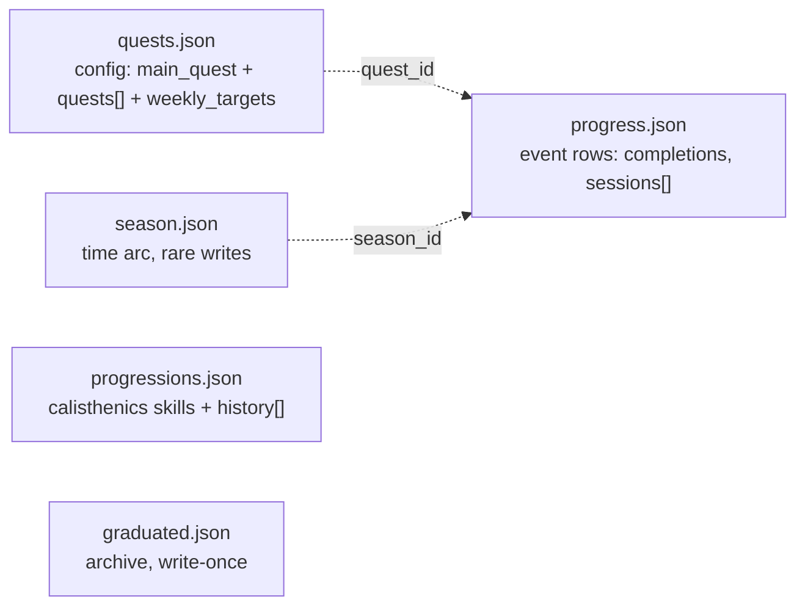

# Ledger split — one file per concern

> Status: **Proposal — not yet approved**, no code changes. Extends ADR 0006 (same v4 field
> shapes, different file boundaries). Owner: Tech Lead.

## Context

`user_data/ledger/challenge_v2.json` mixes four things with different write cadence and growth
(config, daily quest events, block-boundary skill progressions, archive) in one blob. That's not
just messy — it's why three consumers already re-derive the same completion data three different
ways: `gen/quest_history.json` replays `completed_dates`/`missed_dates`/`excused_dates` day-by-day
across every `user_data/coach/archive/seasons/*/challenge_v2.json` snapshot, `gen/aggregate.json`
passes the whole blob through raw *in addition to* that, and season close snapshots the entire
file just so the replay has something to walk. Splitting along concern lines removes the
duplication now and gives each new file a 1:1 target table for the eventual Postgres migration
(`docs/eng-docs/backend-decision.md`'s ERD) — one design, two mechanical realizations.

## Decision (proposed)

`user_data/ledger/` goes from 1 file to 5. Field shapes are unchanged from v4 (ADR 0006) — only
which file each field lives in changes. `current_week.json` and `plugins.json` (also in
`ledger/`) are untouched, out of scope.

**What collapses downstream:**

| Today | After |
|---|---|
| `generate_quest_history.py` — O(days) replay across archived seasons | Thin formatter over `progress.json` rows (already sorted, already complete) |
| `user_data/coach/archive/seasons/*/challenge_v2.json` (whole-file snapshot per season close) | Retired — season boundary is a `season_id` column, not a file copy |
| `build-aggregate.mjs`'s raw `challenge_v2` passthrough | Reads the 5 files directly — no more shipping completion data twice |
| `generate_quest_log.py` | Unchanged shape, reads `quests.json`/`progress.json` instead of arrays |

**Consumers to update** (same list ADR 0006 tracked): `engine/scripts/generate_quest_log.py`,
`engine/scripts/generate_quest_history.py`, `engine/scripts/build-aggregate.mjs`,
`ui/client/src/lib/challenge.ts`, `engine/.github/workflows/validate-data.yml`,
`platform/scripts/carve-skeleton.mjs`, `engine/lib/challenge_schema.py`,
`engine/lib/repo_layout.py` + `repo-layout.mjs` (new path helpers, retire `seasons_dir`),
`docs/ref-docs/milestone-schema.md` (carve source, if `progressions.json` rename is approved).

## Done when

- `validate-data.yml` enforces the 5-file shape; `challenge_v2.json` no longer exists in new repos.
- `generate_quest_history.py` has no per-day replay loop — it formats `progress.json` rows.
- `archive/seasons/` is empty in new/migrated repos; season boundary lives on the row.
- `aggregate.json` size drops (no duplicated completion data) — spot-check against ADR 0020's budget.
- One-shot migration script converts a live repo (Akash's) end to end, output diffs clean against
  `generate_quest_log.py`'s current rendering (same quest log text before/after).

## Open questions (not decided — need athlete input)

1. **`main_quest` splits across files.** Its config (`type`, `target`, `count_pattern`,
   `weekly_floor`, ...) belongs in `quests.json`; its `sessions[]` progress log belongs in
   `progress.json`. Today it's one object. OK to split, or does `main_quest` stay whole in
   `quests.json` (simpler reads, less clean event-row story)?
2. **Does `progress.json` still need a season concept at all?** A quest can carry the same id
   across a season transition (`generate_quest_history.py`'s `process_season` handles this
   explicitly — later season's status wins on overlapping dates). With row-per-event storage, is
   a `season_id` tag on each row needed, or is the row's own date enough and season becomes purely
   a `season.json` display concern?
3. **Rename `milestones` → `progressions`?** It's user-facing (Build Phase widget label,
   `docs/ref-docs/milestone-schema.md`, ADR text) not just a data shape change. Confirm before I
   touch product copy, or keep the file named `milestones.json` even though the concept is
   calisthenics progressions.
4. **Cutover sequencing.** ADR 0006's own v4 migration (validator + carve + live-repo cutover,
   C2–C4) isn't fully landed per `TODO.md`. Do this split as the next stage after v4 closes, or
   fold both into one migration since they touch the same 7 consumers anyway?
5. **File format for the two event-stream files.** Plain pretty-printed JSON (today's pattern —
   every write is a full-file diff) vs. one-line-per-event JSONL (cleaner git diffs, matches how
   these will actually grow, but needs a different parser in every consumer). Worth deciding now
   since it's harder to change once consumers are wired.

## Deferred

- Actual Postgres table DDL — that's `backend-decision.md`'s job once/if that migration is approved.
- Versioning scheme for 5 files (one `version` each vs. a shared manifest) — small, decide at
  implementation time, not blocking the shape discussion.
- Normalizing `weekly_targets` per-sport keys — same shape, just moves file; no schema change needed.
